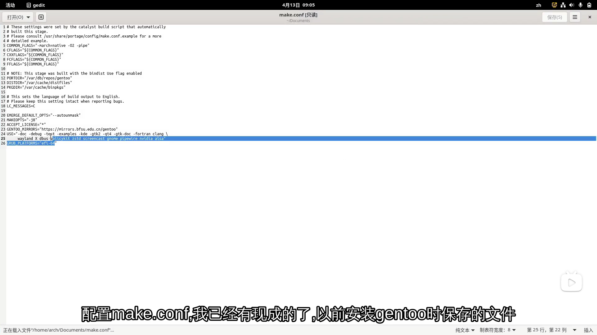
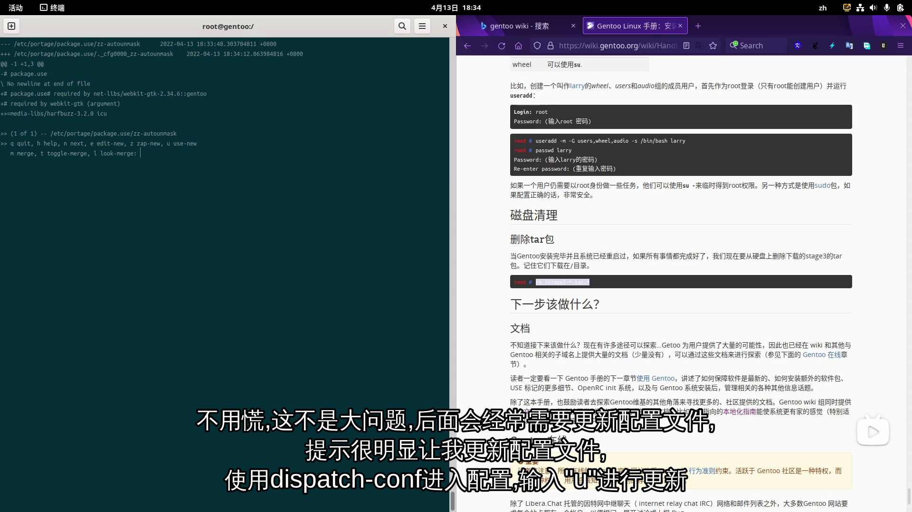

## 引言：

这两张截图是在`Bilibili`网站上看到的安装`Gentoo`很有帮助的`Gentoo`安装教程的图片。

已经忘记了谁发布的视频，大概已经有一段时间了。

或许是2022年前后的一段视频（？），记不清了。

# 图片介绍：

将分别介绍该文件夹中的两张图像，并写下认为对更有用的部分。

如果需要其他部分，可以自己查看。

### [`gentoo_make.conf.png`](https://github.com/jidro/configuration_files/blob/master/Linux_distribution_profile/Gentoo_config/Picture-Tips/gentoo_make.conf.png "gentoo_make.conf.png")



该图片是配置`make.conf`时参考的配置文件（大部分在`USE`部分）。

自己配置的`make.conf`文件，不知道为什么在配置后不断提示软件安装错误。

作为一名编程新手，对编程一无所知，对错误发生的地方一无所知。

因此，找到了一个认为稍微简单的配置，于是首先复制了该配置。

#### 内容如下：

```shell
# These settings were set by the catalyst build script that automatically
# built this stage.
# Please consult /usr/share/portage/config/make.conf. example for a more
# detailed example.
COMMON_FLAGS="-march=native -O2 -pipe"
CFLAGS="${COMMON_FLAGS}"
CXXFLAGS="${COMMON_FLAGS}"
FCFLAGS="${COMMON_FLAGS}"
FFLAGS="${COMMON_FLAGS}"

# NOTE: This stage was built with the bindist Use flag enabled
PORTDIR="/var/db/repos/gentoo"
DISTDIR="/var/cache/distfiles"
PKGDIR="/var/cache/binpkgs"

# This sets the language of build output to English.
# Please keep this setting intact when reporting bugs.
LC_MESSAGES=C

EMERGE_DEFAULT_OPTS="--autounmask"
MAKEOPTS="-j8"
ACCEPT_LICENSE="*"
GENTOO_MIRRORS="https://mirrors.bfsu.edu.cn/gentoo"
USE="-doc -debug -test -examples -kde -gtk2 -qt4 -gtk-doc -fortran clang wayland X dbus policykit zstd screencast gnome pipewire nvidia  alsa"
GRUB_PLATFORMS="efi-64"
```

### [`gentoo_dispatch-conf.png`](https://github.com/jidro/configuration_files/blob/master/Linux_distribution_profile/Gentoo_config/Picture-Tips/gentoo_dispatch-conf.png "gentoo_dispatch-conf.png")



起初，在尝试安装`Gentoo`时，屏幕上出现了这个场景，不知道该怎么做，但后来在视频中看到了这一步，意识到是这样处理的。

非常感谢这位博主的视频。当然，这些都是在`Gentoo`的`Wiki`上有写的。

真的很感激这个视频博主。通过他的视频，第一次成功安装并使用了`Gentoo`系统。

#### 内容如下：

之后，会频繁提示更新配置文件。

当提示更新配置时，使用`dispatch-conf`进入配置并输入`u`进行更新。

##### [Gentoo Wiki](https://wiki.gentoo.org/wiki/Handbook:AMD64/Portage/Tools/zh-cn)：

`dispatch-conf`是一个帮助合并 `._cfg0000_<name>`的工具。

 `._cfg0000_<name>`是由`Portage`在要覆盖被`CONFIG_PROTECT`变量所保护的某个目录里的文件时建立的。

使用 `dispatch-conf`，能够在合并配置文件并升级更新的同时保持所有更新记录。 

`dispatch-conf`以`RCS`版本管理系统或是补丁的方式来保存配置文件间的差别。

这意味着如果在升级配置文件犯下错误时，可以随时退回到你的配置文件的之前版本。

使用 `dispatch-conf`，可以保持配置文件原来的样子，或者使用新的配置文件，还可以编辑当前文件或交互式地合并更新。

除此之外， `dispatch-conf`还有一些很棒的特性：

- 可以自动合并仅有注释变更的文件。
- 可自动合并仅有空白符数量的不同的文件。

首先编辑 `/etc/dispatch-conf.conf` ，并且创建 `archive-dir` 变量设定的目录，然后执行 `dispatch-conf`：

```shell
root # dispatch-conf
```

当运行 `dispatch-conf`的时候，程序会带你把每个改变了的配置文件挨个过一边。

- 按 `u` 键来用新配置文件更新（替换）现在的配置文件，然后继续处理下一个。
  
- 按 `z` 键来删除新配置文件，然后继续处理下一个。
  
- 按 `n` 键让 `dispatch-conf` 跳转到下一个文件。 这样可以将合并推迟到将来的某个时间。
  
- 按 `q` 键来退出当前配置。
  

当处理完所有的配置文件之后， `dispatch-conf`就会退出。

###### `dispatch-conf`平替：

- ① 也可以使用 [`etc-update`](https://wiki.gentoo.org/wiki/Handbook:AMD64/Portage/Tools/zh-cn#etc-update)来合并配置文件。
  
  > `etc-update`不像`dispatch-conf`那样简单易用，功能也少，但是也能提供交互式合并功能并且能自动合并一些简单的改变。
  > 
  > 不过，和`dispatch-conf`不同的是， `etc-update` ***不*** 保留配置文件的旧版本。
  > 
  > 一旦更新了文件，旧版本就永远丢失了。
  > 
  > 所以要非常小心，因为使用`etc-update` 与使用 `dispatch-conf` 相比明显的不安全。
  > 
  > 如果输入`-1`， `etc-update`将直接退出且不执行任何变更。
  > 
  > 如果输入`-3` 或者 `-5`，所有列出的配置文件将被更新的版本覆盖。
  > 
  > 因此先选出无需自动升级的配置文件非常重要，而具体步骤也很简单，只需要输入在该配置文件左边显示的数字就可以了。
  > 
  > 如果认为升级的配置文件可以正确无误的投入使用，输入`1`。
  > 
  > 如果认为升级的配置文件是不必要的，或者也没有提供任何新的或有用的信息，输入`2`。
  > 
  > 如果想交互地升级当前的配置文件，输入`3`。
  > 
  > 当完成重要的配置文件的更新后，余下的其它配置文件就可以采用自动更新的方法了。
  > 
  > 当无法再找到任何可更新的配置文件时`etc-update`将退出。
  
- ② 也可以利用[`quickpkg`](https://wiki.gentoo.org/wiki/Handbook:AMD64/Portage/Tools/zh-cn#quickpkg)可以对系统中已安装的包进行打包归档。
  
  > 利用`quickpkg`可以对系统中已安装的包进行打包归档。
  > 
  > 这些归档文件可以作为预编译包使用。
  > 
  > 运行`quickpkg`非常简单：只要加上想要制作的软件包的名字就可以了。
  > 
  > 预编译包会保存在 `$PKGDIR` 默认为 （`/var/cache/binpkgs/`）。
  > 
  > 这些包的保存在`$PKGDIR/CATEGORY`中。
